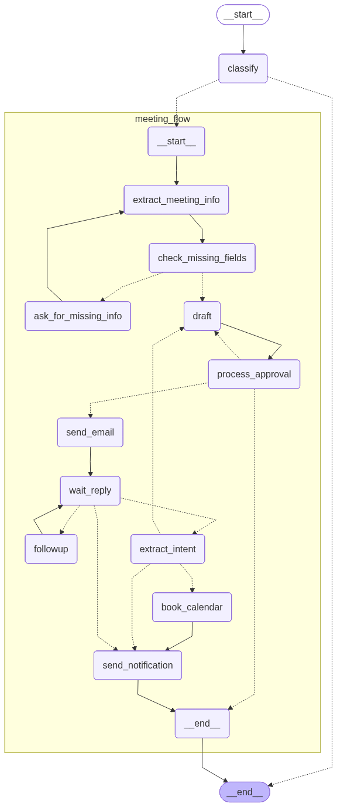

# Email Agent

AI-powered email automation agent with LangGraph-based workflows for intelligent email processing.

## Project Overview

The Email Agent is a multi-service system that:

- Routes incoming emails to appropriate workflows
- Handles meeting scheduling with calendar integration
- Manages email drafts with human-in-the-loop approval
- Provides real-time WebSocket notifications

## Architecture

```
┌─────────────┐     ┌──────────────┐     ┌─────────────┐
│   Client    │───▶│   Agent API  │───▶│   Backend   │
│  (Browser)  │◀───│  (Port 8000) │◀───│ (Port 5001) │
└─────────────┘     └──────────────┘     └─────────────┘
                            │              ┌─────────────┐
                     ┌──────┴──────┐      │  Web UI     │
                     │  LangGraph  │      │  (Static)   │
                     │  Workflows  │      └─────────────┘
                     └─────────────┘
```

## Folder Structure

```
email-agent/
├── agent/               # Agent API service (FastAPI)
│   ├── main.py          # FastAPI entry point
│   ├── routes/          # API endpoints
│   ├── database.py      # SQLAlchemy setup
│   └── services/        # Agent services
├── backend/             # Email backend service (FastAPI)
│   ├── main.py          # FastAPI entry point
│   ├── database.py      # SQLAlchemy setup + seed data
│   ├── models.py        # User, Email models
│   ├── routes/          # API endpoints (auth, email, ws)
│   └── services/        # Email business logic
├── config/              # Configuration
│   └── settings.py      # Pydantic settings
├── src/                 # Core library
│   ├── workflows/       # LangGraph workflows
│   ├── nodes/           # Graph nodes
│   └── integrations/    # LLM & mail clients
├── scripts/             # CLI scripts
│   └── run.py           # Test runner for workflows
├── test/                # Test files
│   ├── conftest.py      # Pytest fixtures
│   ├── test_auth_api.py
│   ├── test_email_api.py
│   └── test_agent_proxy.py
├── notebook/            # Jupyter notebooks
├── assets/              # Test graphs
├── main.py              # Package entry point
└── pyproject.toml       # Project configuration
```

## Testing

Run tests with pytest:

```bash
# Run all tests
pytest

# Run with verbose output
pytest -v

# Run specific test file
pytest test/test_auth_api.py

# Run with coverage
pytest --cov
```

Test files:
- `test/test_auth_api.py` - Authentication API tests
- `test/test_email_api.py` - Email API tests
- `test/test_agent_proxy.py` - Agent proxy tests

Fixtures are defined in `test/conftest.py`.

## Installation

### Prerequisites

- Python 3.10 or higher
- uv (recommended) or pip

### Steps

1. **Clone the repository**

    ```bash
    git clone <repository-url>
    cd email-agent
    ```

2. **Create virtual environment**

    ```bash
    python -m venv .venv
    source .venv/bin/activate  # Linux/macOS
    # .venv\Scripts\activate   # Windows
    ```

3. **Install dependencies**

    ```bash
    # Using uv (recommended)
    uv sync

    # Or using pip
    pip install -e .
    ```

4. **Configure environment variables**

    ```bash
    cp .env.example .env
    ```

    Edit `.env` and set your configuration:

    ```env
    # Database
    DATABASE_URL=sqlite:///email-agent.db

    # Email Backend
    EMAIL_BACKEND_HOST=0.0.0.0
    EMAIL_BACKEND_PORT=5001
    WS_BACKEND_URL=ws://localhost:5001

    # Agent API
    AGENT_HOST=0.0.0.0
    AGENT_PORT=8000

    # External Services
    GOOGLE_API_KEY=your_google_api_key_here
    ```

## Testing

Run tests with pytest:

```bash
# Run all tests
pytest

# Run with verbose output
pytest -v

# Run specific test file
pytest test/test_auth_api.py

# Run with coverage
pytest --cov
```

## Running the Application

### Start Backend API (Port 5001)

The backend handles email storage, user authentication, and WebSocket notifications.

```bash
uvicorn backend.main:app --host 0.0.0.0 --port 5001 --reload
```

### Start Agent API (Port 8000)

The agent handles email processing, workflow routing, and LLM interactions.

```bash
uvicorn agent.main:app --host 0.0.0.0 --port 8000 --reload
```

### Run CLI Test Script

The test script supports various options for testing the meeting scheduler workflow:

```bash
python scripts/run.py [OPTIONS]
```

#### Options

| Option | Description |
| ------ | ----------- |
| `--no-backend` | Run without backend API (emails skipped, soft fail) |
| `--simulate-reply [confirmed\|negotiate\|declined]` | Simulate reply from recipient (only when no_response_count exhausted) |
| `--no-response-count N` | Simulate N rounds of no reply before ending flow |
| `--max-followups N` | Max follow-up attempts before giving up (default: 2) |
| `-m, --message TEXT` | Initial user message (default: "Schedule a meeting with Prof Linh next Monday at 12 am") |
| `--graph-only` | Only generate graph PNG, don't run workflow |

#### Examples

```bash
# Default run (requires backend)
python scripts/run.py

# Run without backend - emails skipped
python scripts/run.py --no-backend

# Simulate confirmed reply (requires backend for email sending)
python scripts/run.py --simulate-reply confirmed

# Run without backend + simulate confirmed reply
python scripts/run.py --no-backend --simulate-reply confirmed

# Simulate no reply for 2 cycles then end
python scripts/run.py --no-response-count 2

# Simulate no reply for 3 cycles + skip email sending
python scripts/run.py --no-backend --no-response-count 3

# Simulate no reply first, then simulate reply (reply ignored after no_response_count exhausted)
python scripts/run.py --no-response-count 2 --simulate-reply confirmed

# Custom message
python scripts/run.py -m "Schedule meeting with John tomorrow at 3pm"

# Generate graph only
python scripts/run.py --graph-only
```


## Web UI

A built-in web interface is available for testing the API. Access it at:

```
http://localhost:5001/
```

### Features

- **Tabbed Interface**: Switch between Auth, Email, and Agent endpoints
- **User Selection**: Dropdown to select test users (alice, bob, charlie)
- **Agent Status**: Real-time WebSocket connection indicator
- **Collapsible Sections**: Organize API calls by category
- **Response Panel**: View JSON responses from API calls

### Usage

1. Start the backend: `uvicorn backend.main:app --host 0.0.0.0 --port 5001 --reload`
2. Open `http://localhost:5001/` in your browser
3. Select a user from the dropdown
4. Click any test button to make API calls
5. View responses in the panel on the right

## Workflows

### Meeting Scheduler

Handles meeting requests by:

1. Extracting meeting details (date, time, participants)
2. Checking for missing information
3. Drafting confirmation email
4. Sending for human approval
5. Sending confirmation or follow-up

### Email Auto-Responder

Routes and responds to emails based on intent classification.

## API Endpoints

### Agent API (Port 8000)

| Method | Endpoint                                | Description                     |
| ------ | --------------------------------------- | ------------------------------- |
| POST   | `/api/agent/draft`                      | Create a new draft              |
| GET    | `/api/agent/draft/{draft_id}`           | Get specific draft              |
| POST   | `/api/agent/draft/{draft_id}/send`      | Send draft                      |
| DELETE | `/api/agent/draft/{draft_id}`           | Cancel draft                    |
| GET    | `/api/agent/drafts`                     | List user's drafts              |
| GET    | `/api/agent/thread/{thread_id}`         | Get thread messages             |
| GET    | `/api/agent/threads`                    | List user's threads             |
| POST   | `/api/agent/thread/{thread_id}/confirm` | Confirm meeting                 |
| POST   | `/api/agent/thread/{thread_id}/decline` | Decline meeting                 |
| GET    | `/api/agent/status/{thread_id}`         | Get workflow status             |
| GET    | `/api/agent/history/{thread_id}`        | Get workflow history            |
| WS     | `/api/agent/ws/{user_id}`               | WebSocket for real-time updates |
| GET    | `/health`                               | Health check                    |

### Backend API (Port 5001)

| Method | Endpoint                    | Description                  |
| ------ | --------------------------- | ---------------------------- |
| GET    | `/api/auth/users`           | List all users               |
| GET    | `/api/auth/users/{user_id}` | Get specific user            |
| PUT    | `/api/auth/users/{user_id}` | Update user                  |
| DELETE | `/api/auth/users/{user_id}` | Delete user                  |
| POST   | `/api/auth/signup`          | User registration            |
| POST   | `/api/auth/login`           | User login                   |
| POST   | `/api/emails/send`          | Send email                   |
| POST   | `/api/emails/reply`         | Reply to email               |
| GET    | `/api/emails/inbox`         | Get inbox                    |
| GET    | `/api/emails/sent`          | Get sent emails              |
| GET    | `/api/emails/{email_id}`    | Get specific email           |
| POST   | `/api/emails/query`         | Query emails                 |
| GET    | `/api/emails/poll`          | Poll for new emails          |
| PUT    | `/api/emails/mark_read`     | Mark email as read           |
| WS     | `/ws/push/{user_id}`        | WebSocket push notifications |
| GET    | `/health`                   | Health check                 |
| GET    | `/`                         | Web UI                       |

## Test Users

The database is seeded with test users:

| Username | Password    |
| -------- | ----------- |
| alice    | password123 |
| bob      | password123 |
| charlie  | password123 |

## Schedule Meeting Workflow


